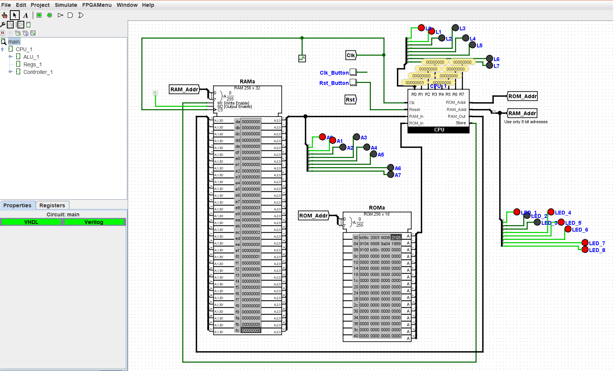
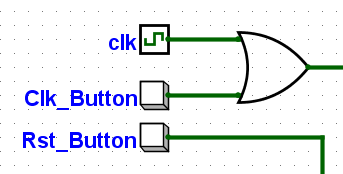

# SI3 Architecture Project

## Directory

    - doc
        - pictures
        - Projet_PARM_SI3_2018.pdf
        - projet_PARM_soutenance.pdf
    - examples
        - c (example program and assembly files)
        - calcultrice (an other example)
        - a bunch of examples for logisim
        - [...]
    - logisim_project
        - armAssembly
            - Assembly (parser program in C#)
            - bin (binary file to execute the parser)
            - README.md (information about how to use the program)
            - deprecated (first implemention using Python (not finish))
            - [...]
        - test
        - ALU.circ
        - BancDeRegistre.circ
        - Controlleur.circ
        - Machine.circ (main circuit)
    - README.md

## About

[github repository](https://github.com/JasonHaenlin/Arms-and-Legs.git)
 *ask Jason ( jason.haenlin@etu.univ-cotedazur.fr ) for authorization*

Creation of a CPU based on the **ARM** architecture with simplifications. 
The main purpose of the project is to undersand the concept behind a CPU using basic assembly instructions.

In result of this project, we are able to undersant how the different communication are made and why. 
We also aknowledge how the **RAM**, **ROM** and **register** are used for variables and instructions.

With this **CPU**, we are able to execute basic program to **store**, **load** variables in the **RAM** et **register**. 
But also the use of condition to make decision and **jump** to a specific line to do a specific instruction. 
A Unit of Arithmetic and logic is also here to make and the computations. 

## supervisors
> Benoit Miramond<br>
> Igor Litovsky

## Team
>Florent Robert     : UAL main developer<br> 
>Gabriel Revelli    : Register bank main developer<br>
>Theo Fafet         : Assembly parser main developer<br>
>Jason Haenlin      : Controller main developer

## Instruction example
### basic program to get the max
#### assembly example
```s
.data               @ data section to set the global variables
    A: .word 0xf    @ A = 15 
    B: .word 0xff   @ B = 255
    MAX: .word 0x0  @ MAX = 0
.end                @ end data section
                    @
.text               @ begin main program section
    LDR R0,A        @ load A variables into RO register
    LDR R1,B        @ load B variables into R1 register
  if:               @ if label
    CMP R0,R1       @ compare R1 and RO 
       BMI else     @ check result, if R1-R0 < 0 jump to else label
    STR R0,MAX      @ otherwise store the RO register into MAX
       B endif      @ jump to endif to avoid doing the else part
  else:             @ else part
    STR R1,MAX      @ store the R1 register into MAX
  endif:            @ endif
.end                @ end of text section (end of program)
```
#### result in hexadecimal
```s
9800 #PC1 LDR R0, A
9901 #PC2 LDR R1, B
4288 #PC3 CMP R0, R1
d406 #PC4 BMI else
9002 #PC5 STR R0, MAX
de07 #PC6 B endif
9102 #PC7 STR R1, MAX 
```

## Logisim
### About
>Logisim is a logic simulator which permits circuits to be designed and simulated using a graphical user interface.<br>
[more information](https://en.wikipedia.org/wiki/Logisim)

### Installation
Clone with git or download the zip chosing a version on this [git repository](https://github.com/reds-heig/logisim-evolution/releases)

For our project, we used the **version 2.14.6** 

### Execution
Logisim is compile using Java langage so any version will work the same way on any **Operating System**
You need Java JDK installed on your computer first.

Use this command to launch Logisim
````
    java -jar ./logisim-evolution.jar 
````
you can also use :
```
    javaw -jar ./logisim-evolution.jar -analze
```
> this command execute a jar in background with analyze enable.<br>
> **analyze** is used to active the circuit creation using truth table or logical equation. <br>
> In logisim **project>analyze circuit**

### Run a Program

After lauching **Logisim** you need to open the **Machine.circ** file
<br>*File>Open* and choose *./logisim_project/Machine.circ* 

Global view of the project


 
To run a program, first you need to load the instruction by right clicking on the **ROM Component** and then **Load image** from
the examples folder with the prefix **rom** and in second you might need to load a RAM file if a **RAM** prefix is present with the same name. When one or both are load, you can start the execution by activating the clock.


 1. The clock symbol can be enable and disable manually or can be set automatically with a specific frequency in the tab **>Simulate>Tick Enable** and **>Simulate>Tick Frequency**
 2. The clock button can be use to move step by step and observe the changement in the ROM, RAM and register
 3. The reset button can be used to reset the Circuit and the Counter to 0 to start again from instruction 1.

# Overview

>Read the project documentation for further information.<br>
 *./doc/Projet_PARM_SI3_2018.pdf*

# Mnemonics

**Immediat** : an immediate is a piece of (constant) information stored as part of the current instruction instead of being in the memory or register. They are generally used to load instructions and perform arithmetic or logical operations.

 